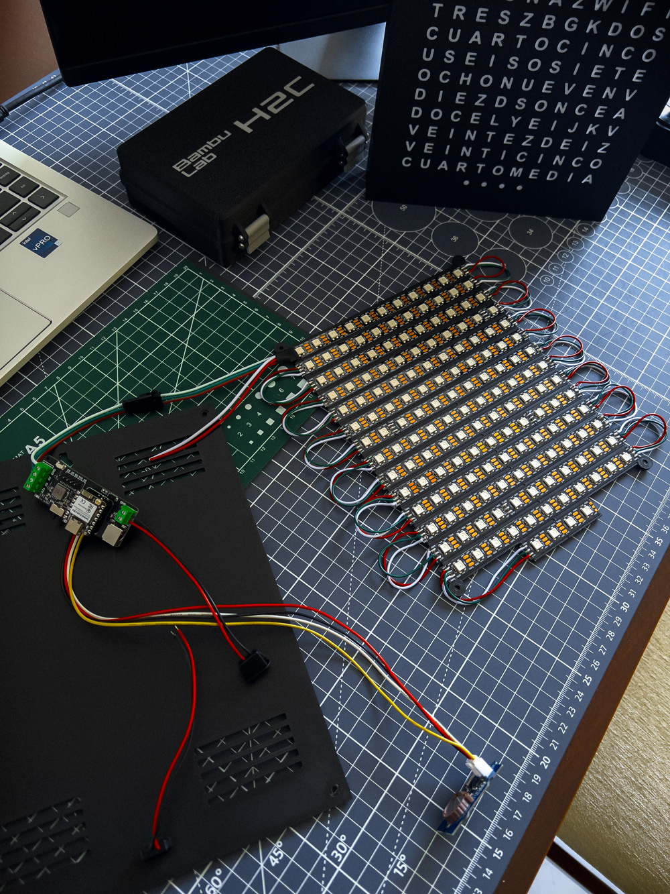
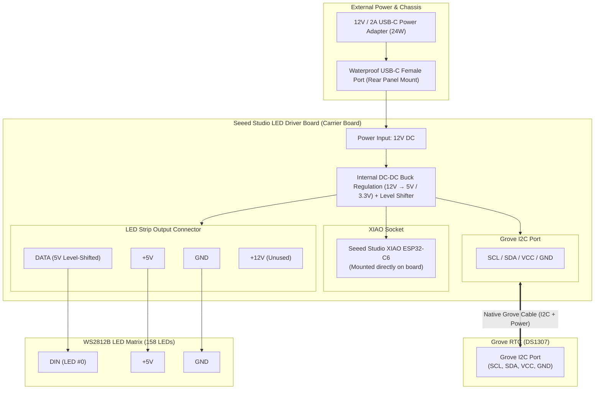
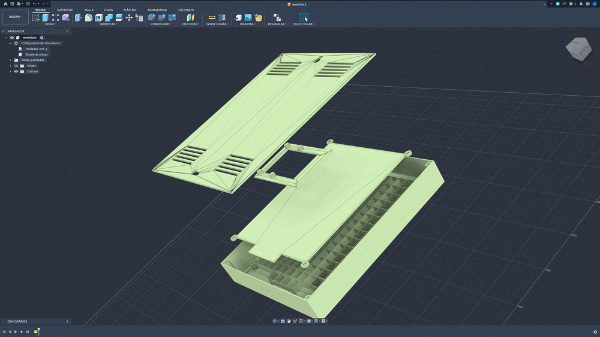

# Mexican Spanish Word Clock (WordClock)
### Hardware: Seeed Studio XIAO ESP32-C6 + 158-LED WS2812B Matrix

[](https://ainxstep.github.io/wordclock-xiao-led/)
[](LICENSE)
[](https://wiki.seeedstudio.com/xiao_esp32c6_getting_started/)

🌐 **Idioma / Language:** [Español](README.md) | **English**

<p align="center">
  
  <br>
  <em>Physical WordClock running in Mexican Spanish showing 1:37 («SON VEINTICINCO PARA LAS DOS» + 2 minute dots)</em>
</p>

---

Complete project featuring hardware, firmware, 3D printable models, and an interactive web simulator for a Word Clock (*WordClock*) **specifically regionalized for Mexican Spanish** (as spoken colloquially throughout Central Mexico), driven by an addressable 158-LED WS2812B matrix with WiFi AP configuration and RTC timekeeping.

---

## 🇲🇽 Key Differentiator: Mexican Spanish Colloquial Syntax

The vast majority of Spanish word clocks available online follow the European (Castilian) Spanish convention, which relies on a subtraction structure (*"Las tres menos cuarto"* / Three minus a quarter, *"Las cuatro menos diez"* / Four minus ten).

In **Mexico**, everyday colloquial speech flips the structure after minute 35, expressing the minutes remaining **UNTIL (PARA)** the next hour:

* ❌ **European Spanish syntax:** `SON LAS TRES MENOS CUARTO`
* 🇲🇽 **Mexican Spanish syntax (this WordClock):** `CUARTO PARA LAS TRES` (Quarter to three), `DIEZ PARA LAS CUATRO` (Ten to four), `VEINTICINCO PARA LA UNA` (Twenty-five to one)

### Custom Physical Matrix Architecture
To support this Mexican syntax naturally and legibly, the 11×14 LED matrix is divided into three functional vertical sections:

1. **Top Rows (1–4) - The "PARA" (To) Block:** Houses the pre-hour minute phrases (`VEINTICINCO`, `DIEZ`, `VEINTE`, `CUARTO`), the keyword `PARA`, articles `LA` / `LAS` / `UNA`, and the `WIFI` status indicator.
2. **Middle Rows (5–10) - The Hours Block:** Houses the twelve hours (`UNA` through `DOCE`) in an optimized sequence.
3. **Bottom Rows (11–13) - The "Y" (Past) Block:** Houses the conjunction `Y` and minutes for the first half of the hour (`DIEZ`, `VEINTE`, `VEINTICINCO`, `CUARTO`, `MEDIA`).
4. **Row 14 (Precision Dots):** 4 individual LEDs (+1, +2, +3, +4) for single-minute accuracy.

---

## Repository Structure

The repository is organized into modular directories for clean navigation and maintenance:

```text
wordclock/
├── docs/                                  # Technical specifications, diagrams, and assets
│   ├── images/                            # Photographs and project renders
│   │   ├── wordclock-front.jpg            # Front view in operation
│   │   ├── wordclock-internals.jpg        # Internal assembly and electronics
│   │   └── wordclock-angle.jpg            # Exploded 3D CAD assembly render
│   ├── matrix-layout.txt                  # Physical progressive LED indexing layout (158 LEDs)
│   └── matrix-grid.txt                    # Letter grid distribution (11x14)
│
├── simulator/                             # Interactive Web Simulator
│   ├── index.html                         # Simulator user interface
│   ├── index.css                          # Visual styling and realistic LED glow effects
│   └── app.js                             # Mexican Spanish clock logic, modes, and WiFi portal
│
├── arduino/                               # Firmware for Arduino IDE
│   ├── wordclock/                         # Main sketch folder
│   │   └── wordclock.ino                  # Complete firmware (ESP32-C6 + FastLED + DS1307 RTC + AP Web Portal)
│   ├── test_words/                        # Diagnostic and test sketch
│   │   └── test_words.ino                 # Sequential word and LED lighting tests
│   └── reference/                         # Reference source codes and examples
│       └── wordclock-example.code.txt
│
├── 3d_models/                             # 3D Printing files (OpenSCAD, STL, 3MF)
│   ├── best_parameters.txt                # Recommended slicing parameters (Bambu Studio)
│   ├── opcion_1_tapa_superpuesta/         # Option 1: External overlaid back lid for standard frame
│   └── opcion_2_tapa_incrustada_al_ras/   # Option 2: Flush-mount embedded lid for optimized frame
│
└── LICENSE                                # Dual license (MIT for software, CC BY-SA 4.0 for hardware/3D)
```

---

## Hardware and Bill of Materials (BOM)

* **Carrier / Driver Board**: [Seeed LED Driver Board](https://wiki.seeedstudio.com/led_driver_board/) (Single 12V DC input, internal DC-DC regulation, integrated XIAO socket, Grove I2C port, and direct LED strip output connector)
* **Microcontroller**: [Seeed Studio XIAO ESP32-C6](https://wiki.seeedstudio.com/xiao_esp32c6_getting_started/) (seated directly into the driver board socket)
* **RTC Module**: [Grove - DS1307 RTC](https://wiki.seeedstudio.com/Grove-RTC/#pre-reading) (connected via native Grove cable to the driver board I2C port)
* **LED Strip**: WS2812B @ 74 LEDs/m (158 total LEDs: 11×14 matrix + 4 individual minute dots)
* **Chassis Power Port**: [Waterproof USB-C Female Panel Mount Connector (2-Pin, 3A)](https://es.aliexpress.com/item/1005011950115260.html) with pigtail extension cable
* **Power Supply**: [Universal 24W USB-C Power Adapter (12V @ 2A)](https://es.aliexpress.com/item/1005007438665930.html)

<p align="center">
  
  <br>
  <em>Internal assembly and wiring: Seeed LED Driver Board hosting the XIAO ESP32-C6, Grove RTC (DS1307), ventilated rear backplate, and interconnected WS2812B LED strip carrier plate</em>
</p>

### Wiring Diagram



### Pinout Table

| Connector / Port | Pins / Terminals | Connected Device | Function / Description |
| :--- | :--- | :--- | :--- |
| **Rear Panel (Chassis)** | `VBUS (12V)`, `GND` | [Waterproof USB-C Female Port](https://es.aliexpress.com/item/1005011950115260.html) | External chassis port for convenient 12V power connection via USB-C |
| **Driver Board DC Input**| `12V`, `GND` | [Universal 12V @ 2A USB-C Adapter](https://es.aliexpress.com/item/1005007438665930.html) | Primary 24W switching power supply feeding the carrier board |
| **XIAO Socket** | Female headers | [XIAO ESP32-C6](https://wiki.seeedstudio.com/xiao_esp32c6_getting_started/) | Direct power delivery, I2C bus sharing, and `D0/GPIO 0` signal |
| **Grove I2C Port** | `SCL`, `SDA`, `VCC`, `GND` | [Grove RTC (DS1307)](https://wiki.seeedstudio.com/Grove-RTC/#pre-reading) | Plug-and-play Grove cable (I2C communication + power) |
| **LED Output Block** | `DATA`, `+5V`, `GND` | WS2812B Matrix (158 LEDs) | Regulated 5V power output and digital signal for first LED (`DIN`) |

> [!TIP]
> **Power Delivery**: The clock requires only a single **12V @ 2A** external power supply. The Seeed LED Driver Board internally handles all voltage step-down and regulation: 3.3V for the XIAO microcontroller, 5V for the Grove RTC module, and clean 5V with high current headroom for the 158 WS2812B LEDs.


---

## Letter Matrix (11×14 + 4 Dots)

```text
Row 0  (0-10):    E S O N X L A S U N A    (ES, SON, LA, LAS, UNA)
Row 1  (11-21):   V E I N T I C I N C O    (Minutes for "PARA" phrase)
Row 2  (22-32):   D I E Z V E I N T E G    (Minutes for "PARA" phrase)
Row 3  (33-43):   C U A R T O K P A R A    (CUARTO, PARA)
Row 4  (44-54):   L A S U N A Z W I F I    (LA, LAS, UNA for "PARA" + WIFI)
Row 5  (55-65):   T R E S Z B G K D O S    (Hours: TRES, DOS)
Row 6  (66-76):   C U A T R O C I N C O    (Hours: CUATRO, CINCO)
Row 7  (77-87):   U S E I S O S I E T E    (Hours: SEIS, SIETE)
Row 8  (88-98):   O C H O N U E V E N V    (Hours: OCHO, NUEVE)
Row 9  (99-109):  D I E Z D S O N C E A    (Hours: DIEZ, ONCE)
Row 10 (110-120): D O C E L Y E I J K V    (Hours: DOCE, Conjunction Y)
Row 11 (121-131): V E I N T E Z D I E Z    (Minutes for "Y" phrase)
Row 12 (132-142): V E I N T I C I N C O    (Minutes for "Y" phrase)
Row 13 (143-153): C U A R T O M E D I A    (Minutes for "Y" phrase)
Row 14 (154-157): Minute Dots (+1, +2, +3, +4)
```

* **"Y" Block** (minutes 00 to 34): *e.g., "SON LAS ONCE Y VEINTE"*, *"ES LA UNA Y DIEZ"*
* **"PARA" Block** (minutes 35 to 59): *e.g., "VEINTICINCO PARA LAS DOCE"*, *"CUARTO PARA LA UNA"*
* **Minute Dots (+1 to +4)**: Single-minute exact reading.

---

## Getting Started

### 1. Web Simulator
* **🌐 Live Online (No install needed)**: Try the interactive simulator directly at [ainxstep.github.io/wordclock-xiao-led](https://ainxstep.github.io/wordclock-xiao-led/).
* **💻 Run Locally**: Open `simulator/index.html` directly in any modern web browser to test word illumination in Mexican Spanish, adjust time with the slider, or sync to your browser's clock.

### 2. Firmware (Arduino IDE)
1. Install **ESP32 by Espressif Systems** via the Arduino IDE Boards Manager.
2. Install the required libraries: `FastLED` and `RTClib` (by Adafruit).
3. Open the sketch `arduino/wordclock/wordclock.ino`.
4. Select board **Seeed Studio XIAO ESP32C6** and your USB serial port.
5. Compile and upload.

### 3. Initial Setup and WiFi Portal

When connecting the clock to USB power, the word **WIFI** pulses gently during the first **60 seconds**, indicating that the configuration access point is active and ready for incoming connections.

1. **Connect to the network**: From your phone or computer, connect to the WiFi network **`WORDCLOCK-SETUP`** (open network, no password required).
2. **Access the portal**: A captive portal window will appear automatically. If it does not, open your browser and navigate to `http://192.168.4.1`.
3. **Customize your preferences**:
   * **Sync Time**: Tap the sync button to instantly write your phone's exact date and time to the Grove DS1307 RTC chip.
   * **Color & Brightness**: Pick the word display color and adjust day and night brightness levels (backed by Gamma 2.2 perceptual correction).
   * **Night Schedule**: Set the start and end hours for the dimmed night mode (e.g., 22:00 to 06:00).
4. **Save**: Tap **"Guardar Configuración"**. Settings apply immediately and are persisted into the ESP32's non-volatile storage (NVS).

> [!NOTE]
> **Normal Operation & Reconfiguration**: After 60 seconds without connection or as soon as you disconnect, the WiFi radio and the word **WIFI** turn off completely to eliminate RF emissions. To reopen the configuration portal in the future, simply **unplug and reconnect the USB power cable**.

### 4. 3D Printing and Assembly

<p align="center">
  
  <br>
  <em>Exploded 3D CAD assembly view: Main front bezel with optical isolation baffles, LED carrier plate, electronics mounting frame, and ventilated rear lid</em>
</p>

Within `3d_models/`, you will find both parametric OpenSCAD scripts and ready-to-slice `.stl` / `.3mf` files:
* **Main front bezel (`wordclock_main_frame`)**: Front faceplate featuring individually walled letter cavities and minute dots designed to eliminate light bleeding across adjacent letters.
* **LED carrier plate (`wordclock_led_plate`)**: Grid plate with alignment guides for placing and securing the 14 WS2812B LED strip segments.
* **Electronics bracket (`wordclock_electronics_mount`)**: Dedicated chassis bracket to fasten the Seeed LED Driver Board and RTC module.
* **Rear back lid (`wordclock_back_lid`)**: Available in two variants: **Option 1** (overlaid back lid) and **Option 2** (flush-mount embedded lid), both equipped with passive heat dissipation louvers.

Refer to `3d_models/best_parameters.txt` for recommended layer heights, line widths, and infill profiles in Bambu Studio.

> [!TIP]
> **Ready-to-Print Bambu Studio Project**: If you use a Bambu Lab printer (or Bambu Studio / OrcaSlicer), open the pre-configured project file [`3d_models/opcion_2_tapa_incrustada_al_ras/wordclock.3mf`](3d_models/opcion_2_tapa_incrustada_al_ras/wordclock.3mf). It features pre-arranged build plates, optimal print orientations, material assignments, and slicing parameters ready for one-click printing.

---

## License

This project is licensed under a dual-licensing scheme:
* **Software and Firmware (`arduino/`, `simulator/`)**: [MIT License](LICENSE).
* **3D Models, Hardware and Documentation (`3d_models/`, `docs/`)**: [Creative Commons Attribution-ShareAlike 4.0 International (CC BY-SA 4.0)](LICENSE).
