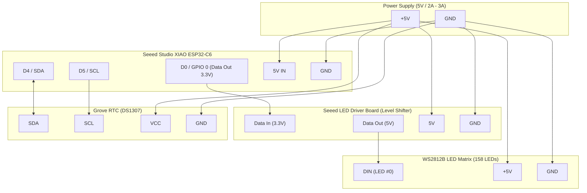

# Mexican Spanish Word Clock (WordClock)
### Hardware: Seeed Studio XIAO ESP32-C6 + 158-LED WS2812B Matrix

[](https://ainxstep.github.io/wordclock-xiao-led/)
[](LICENSE)
[](https://wiki.seeedstudio.com/xiao_esp32c6_getting_started/)

🌐 **Idioma / Language:** [Español](README.md) | **English**

<p align="center">
  
  <br>
  <em>Physical WordClock running in Mexican Spanish showing 1:37 («SON VEINTICINCO PARA LAS DOS» + 2 minute dots)</em>
</p>

---

Complete project featuring hardware, firmware, 3D printable models, and an interactive web simulator for a Word Clock (*WordClock*) **specifically regionalized for Mexican Spanish** (as spoken colloquially throughout Central Mexico), driven by an addressable 158-LED WS2812B matrix with WiFi AP configuration and RTC timekeeping.

---

## 🇲🇽 Key Differentiator: Mexican Spanish Colloquial Syntax

The vast majority of Spanish word clocks available online follow the European (Castilian) Spanish convention, which relies on a subtraction structure (*"Las tres menos cuarto"* / Three minus a quarter, *"Las cuatro menos diez"* / Four minus ten).

In **Mexico**, everyday colloquial speech flips the structure after minute 35, expressing the minutes remaining **UNTIL (PARA)** the next hour:

* ❌ **European Spanish syntax:** `SON LAS TRES MENOS CUARTO`
* 🇲🇽 **Mexican Spanish syntax (this WordClock):** `CUARTO PARA LAS TRES` (Quarter to three), `DIEZ PARA LAS CUATRO` (Ten to four), `VEINTICINCO PARA LA UNA` (Twenty-five to one)

### Custom Physical Matrix Architecture
To support this Mexican syntax naturally and legibly, the 11×14 LED matrix is divided into three functional vertical sections:

1. **Top Rows (1–4) - The "PARA" (To) Block:** Houses the pre-hour minute phrases (`VEINTICINCO`, `DIEZ`, `VEINTE`, `CUARTO`), the keyword `PARA`, articles `LA` / `LAS` / `UNA`, and the `WIFI` status indicator.
2. **Middle Rows (5–10) - The Hours Block:** Houses the twelve hours (`UNA` through `DOCE`) in an optimized sequence.
3. **Bottom Rows (11–13) - The "Y" (Past) Block:** Houses the conjunction `Y` and minutes for the first half of the hour (`DIEZ`, `VEINTE`, `VEINTICINCO`, `CUARTO`, `MEDIA`).
4. **Row 14 (Precision Dots):** 4 individual LEDs (+1, +2, +3, +4) for single-minute accuracy.

---

## Repository Structure

The repository is organized into modular directories for clean navigation and maintenance:

```text
wordclock/
├── docs/                                  # Technical specifications, diagrams, and assets
│   ├── images/                            # Photographs of the assembled physical clock
│   │   └── wordclock-front.jpg
│   ├── matrix-layout.txt                  # Physical progressive LED indexing layout (158 LEDs)
│   └── matrix-grid.txt                    # Letter grid distribution (11x14)
│
├── simulator/                             # Interactive Web Simulator
│   ├── index.html                         # Simulator user interface
│   ├── index.css                          # Visual styling and realistic LED glow effects
│   └── app.js                             # Mexican Spanish clock logic, modes, and WiFi portal
│
├── arduino/                               # Firmware for Arduino IDE
│   ├── wordclock/                         # Main sketch folder
│   │   └── wordclock.ino                  # Complete firmware (ESP32-C6 + FastLED + DS1307 RTC + AP Web Portal)
│   ├── test_words/                        # Diagnostic and test sketch
│   │   └── test_words.ino                 # Sequential word and LED lighting tests
│   └── reference/                         # Reference source codes and examples
│       └── wordclock-example.code.txt
│
├── 3d_models/                             # 3D Printing files (OpenSCAD, STL, 3MF)
│   ├── best_parameters.txt                # Recommended slicing parameters (Bambu Studio)
│   ├── opcion_1_tapa_superpuesta/         # Option 1: External overlaid back lid for standard frame
│   └── opcion_2_tapa_incrustada_al_ras/   # Option 2: Flush-mount embedded lid for optimized frame
│
└── LICENSE                                # Dual license (MIT for software, CC BY-SA 4.0 for hardware/3D)
```

---

## Hardware Components

* **Microcontroller**: [Seeed Studio XIAO ESP32-C6](https://wiki.seeedstudio.com/xiao_esp32c6_getting_started/)
* **LED Driver**: Seeed LED Driver Board (Bidirectional 3.3V → 5V Level Shifter)
* **LED Strip**: WS2812B @ 74 LEDs/m (158 total LEDs: 11×14 matrix + 4 individual minute dots)
* **RTC Module**: Grove - DS1307 RTC (Native I2C bus @ 100 kHz)
* **Key Pinout**:
  * LED Data Pin: `D0` / `GPIO 0`
  * Built-in LED (AP Status): `GPIO 15`
  * I2C Bus: Native Grove SDA/SCL pins (`D4` / `D5`)

### Wiring Diagram



### Pinout Table

| Source Device | Source Pin | Destination Device | Destination Pin | Function / Description |
| :--- | :--- | :--- | :--- | :--- |
| **XIAO ESP32-C6** | `D0` (`GPIO 0`) | **LED Driver Board** | `DIN (3.3V)` | FastLED data signal |
| **LED Driver Board** | `DOUT (5V)` | **WS2812B Matrix** | `DIN` (LED #0) | Level-shifted 5V LED data |
| **XIAO ESP32-C6** | `D4` (`SDA`) | **Grove RTC DS1307** | `SDA` | I2C Data bus (100 kHz) |
| **XIAO ESP32-C6** | `D5` (`SCL`) | **Grove RTC DS1307** | `SCL` | I2C Clock bus |
| **5V Power Supply** | `+5V` | **All Modules** | `5V` / `VCC` | Shared positive voltage line |
| **5V Power Supply** | `GND` | **All Modules** | `GND` | Common ground reference |

> [!TIP]
> **Recommended Power Supply**: A regulated **5V @ 2A or 3A** power adapter is recommended. While typical operation only illuminates active time words (< 1A draw), adequate current capacity prevents brownouts and random ESP32-C6 reboots.

---

## Letter Matrix (11×14 + 4 Dots)

```text
Row 0  (0-10):    E S O N X L A S U N A    (ES, SON, LA, LAS, UNA)
Row 1  (11-21):   V E I N T I C I N C O    (Minutes for "PARA" phrase)
Row 2  (22-32):   D I E Z V E I N T E G    (Minutes for "PARA" phrase)
Row 3  (33-43):   C U A R T O K P A R A    (CUARTO, PARA)
Row 4  (44-54):   L A S U N A Z W I F I    (LA, LAS, UNA for "PARA" + WIFI)
Row 5  (55-65):   T R E S Z B G K D O S    (Hours: TRES, DOS)
Row 6  (66-76):   C U A T R O C I N C O    (Hours: CUATRO, CINCO)
Row 7  (77-87):   U S E I S O S I E T E    (Hours: SEIS, SIETE)
Row 8  (88-98):   O C H O N U E V E N V    (Hours: OCHO, NUEVE)
Row 9  (99-109):  D I E Z D S O N C E A    (Hours: DIEZ, ONCE)
Row 10 (110-120): D O C E L Y E I J K V    (Hours: DOCE, Conjunction Y)
Row 11 (121-131): V E I N T E Z D I E Z    (Minutes for "Y" phrase)
Row 12 (132-142): V E I N T I C I N C O    (Minutes for "Y" phrase)
Row 13 (143-153): C U A R T O M E D I A    (Minutes for "Y" phrase)
Row 14 (154-157): Minute Dots (+1, +2, +3, +4)
```

* **"Y" Block** (minutes 00 to 34): *e.g., "SON LAS ONCE Y VEINTE"*, *"ES LA UNA Y DIEZ"*
* **"PARA" Block** (minutes 35 to 59): *e.g., "VEINTICINCO PARA LAS DOCE"*, *"CUARTO PARA LA UNA"*
* **Minute Dots (+1 to +4)**: Single-minute exact reading.

---

## Getting Started

### 1. Web Simulator
* **🌐 Live Online (No install needed)**: Try the interactive simulator directly at [ainxstep.github.io/wordclock-xiao-led](https://ainxstep.github.io/wordclock-xiao-led/).
* **💻 Run Locally**: Open `simulator/index.html` directly in any modern web browser to test word illumination in Mexican Spanish, adjust time with the slider, or sync to your browser's clock.

### 2. Firmware (Arduino IDE)
1. Install **ESP32 by Espressif Systems** via the Arduino IDE Boards Manager.
2. Install the required libraries: `FastLED` and `RTClib` (by Adafruit).
3. Open the sketch `arduino/wordclock/wordclock.ino`.
4. Select board **Seeed Studio XIAO ESP32C6** and your USB serial port.
5. Compile and upload.

### 3. 3D Printing
All parametric OpenSCAD sources and exported `.stl` / `.3mf` files are located in `3d_models/`. Check `3d_models/best_parameters.txt` for recommended layer heights, line widths, and infill patterns.

---

## License

This project is licensed under a dual-licensing scheme:
* **Software and Firmware (`arduino/`, `simulator/`)**: [MIT License](LICENSE).
* **3D Models, Hardware and Documentation (`3d_models/`, `docs/`)**: [Creative Commons Attribution-ShareAlike 4.0 International (CC BY-SA 4.0)](LICENSE).
