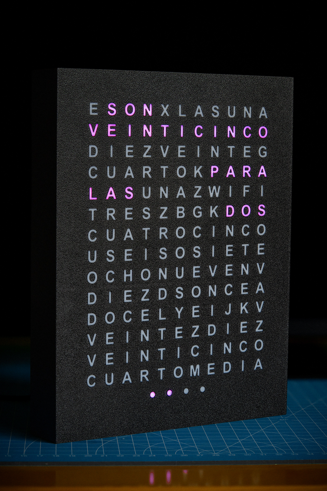
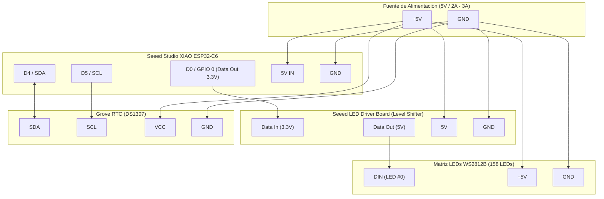

# Reloj de Palabras (WordClock) - Español Mexicano
### Hardware: Seeed Studio XIAO ESP32-C6 + Matriz 158 LEDs WS2812B

[](https://ainxstep.github.io/wordclock-xiao-led/)
[](LICENSE)
[](https://wiki.seeedstudio.com/xiao_esp32c6_getting_started/)

🌐 **Idioma / Language:** **Español** | [English](README.en.md)

<p align="center">
  
  <br>
  <em>WordClock en funcionamiento físico mostrando las 1:37 («SON VEINTICINCO PARA LAS DOS» + 2 minutos)</em>
</p>

---

Proyecto completo de hardware, firmware, modelos 3D y simulador web para un reloj de palabras (*WordClock*) **regionalizado para el español de México** (particularmente el centro del país), con matriz de 158 LEDs direccionables WS2812B y sincronización WiFi / RTC.

---

## 🇲🇽 El Factor Diferenciador: Español Mexicano

La inmensa mayoría de los relojes de palabras en español existentes en internet fueron creados según la convención de España (castellano europeo), la cual utiliza la estructura de resta (*"Las tres menos cuarto"*, *"Las cuatro menos diez"*, *"Las seis menos veinte"*).

En **México**, la manera natural y cotidiana en que decimos la hora invierte la estructura a partir del minuto 35, expresando los minutos que faltan **PARA** la siguiente hora:

* ❌ **Enfoque europeo:** `SON LAS TRES MENOS CUARTO`
* 🇲🇽 **Enfoque mexicano (este WordClock):** `CUARTO PARA LAS TRES`, `DIEZ PARA LAS CUATRO`, `VEINTICINCO PARA LA UNA`

### Adaptación física de la matriz
Para soportar esta sintaxis mexicana de forma natural y visualmente coherente, la matriz de 11×14 se dividió estratégicamente en 3 secciones:

1. **Filas superiores (1 a 4) - Bloque "PARA":** Contienen los minutos preliminares (`VEINTICINCO`, `DIEZ`, `VEINTE`, `CUARTO`), la palabra clave `PARA`, y los artículos `LA` / `LAS` / `UNA` más el indicador de estado `WIFI`.
2. **Filas intermedias (5 a 10) - Bloque de Horas:** Mapean las doce horas (`UNA` a `DOCE`) en orden lógico y optimizado.
3. **Filas inferiores (11 a 13) - Bloque "Y":** Contienen la conjunción `Y` junto con los minutos para la primera mitad de la hora (`DIEZ`, `VEINTE`, `VEINTICINCO`, `CUARTO`, `MEDIA`).
4. **Fila 14 (Puntos de precisión):** 4 LEDs individuales (+1, +2, +3, +4) para lectura exacta minuto a minuto.

---

## Estructura del Repositorio

El repositorio está organizado en módulos independientes para facilitar la navegación y el mantenimiento:

```text
wordclock/
├── docs/                                  # Especificaciones técnicas, esquemas y recursos
│   ├── images/                            # Fotografías del proyecto físico ensamblado
│   │   └── wordclock-front.jpg
│   ├── matrix-layout.txt                  # Mapeo físico detallado de los 158 LEDs (cableado progresivo)
│   └── matrix-grid.txt                    # Distribución de la cuadrícula de texto (11x14)
│
├── simulator/                             # Simulador Web interactivo
│   ├── index.html                         # Interfaz gráfica del simulador
│   ├── index.css                          # Estilos visuales y efectos de iluminación LED
│   └── app.js                             # Lógica de tiempo en español mexicano y portal WiFi
│
├── arduino/                               # Firmware para Arduino IDE
│   ├── wordclock/                         # Sketch principal
│   │   └── wordclock.ino                  # Firmware completo (ESP32-C6 + FastLED + RTC DS1307 + AP Portal)
│   ├── test_words/                        # Sketch de diagnóstico y pruebas
│   │   └── test_words.ino                 # Prueba secuencial de palabras e iluminación
│   └── reference/                         # Códigos de referencia y ejemplos base
│       └── wordclock-example.code.txt
│
├── 3d_models/                             # Archivos de impresión 3D (OpenSCAD, STL, 3MF)
│   ├── best_parameters.txt                # Parámetros recomendados de laminación (Bambu Studio)
│   ├── opcion_1_tapa_superpuesta/         # Opción 1: Tapa exterior superpuesta para marco estándar
│   └── opcion_2_tapa_incrustada_al_ras/   # Opción 2: Tapa incrustada al ras para marco optimizado
│
└── LICENSE                                # Licencia dual (MIT para software, CC BY-SA 4.0 para hardware/3D)
```

---

## Hardware Utilizado

* **Microcontrolador**: [Seeed Studio XIAO ESP32-C6](https://wiki.seeedstudio.com/xiao_esp32c6_getting_started/)
* **Driver de LEDs**: Seeed LED Driver Board (Level Shifter bidireccional 3.3V → 5V)
* **Tira de LEDs**: WS2812B de 74 LEDs/m (158 LEDs en total: matriz 11×14 + 4 puntos de minutos)
* **Módulo RTC**: Grove - DS1307 RTC (bus I2C nativo a 100 kHz)
* **Pines Principales**:
  * Pin de datos LEDs: `D0` / `GPIO 0`
  * LED integrado (estado AP): `GPIO 15`
  * Bus I2C: Pines Grove SDA/SCL (`D4` / `D5`)

### Diagrama de Conexiones



### Tabla de Cableado

| Componente Origen | Pin Origen | Componente Destino | Pin Destino | Función / Descripción |
| :--- | :--- | :--- | :--- | :--- |
| **XIAO ESP32-C6** | `D0` (`GPIO 0`) | **LED Driver Board** | `DIN (3.3V)` | Señal digital FastLED |
| **LED Driver Board** | `DOUT (5V)` | **Matriz WS2812B** | `DIN` (LED #0) | Datos con nivel elevado a 5V |
| **XIAO ESP32-C6** | `D4` (`SDA`) | **Grove RTC DS1307** | `SDA` | Bus I2C Datos (100 kHz) |
| **XIAO ESP32-C6** | `D5` (`SCL`) | **Grove RTC DS1307** | `SCL` | Bus I2C Reloj |
| **Fuente 5V** | `+5V` | **Todos** | `5V` / `VCC` | Línea de alimentación positiva común |
| **Fuente 5V** | `GND` | **Todos** | `GND` | Línea de tierra común |

> [!TIP]
> **Alimentación recomendada**: Se recomienda una fuente regulada de **5V a 2A o 3A**. Aunque en operación normal solo se iluminan las palabras de la hora activa (consumo típico < 1A), este margen previene caídas de voltaje y reinicios espontáneos del ESP32-C6.

---

## Matriz de Letras (11×14 + 4 Puntos)

```text
Fila 0  (0-10):    E S O N X L A S U N A    (ES, SON, LA, LAS, UNA)
Fila 1  (11-21):   V E I N T I C I N C O    (Minutos para bloque PARA)
Fila 2  (22-32):   D I E Z V E I N T E G    (Minutos para bloque PARA)
Fila 3  (33-43):   C U A R T O K P A R A    (CUARTO, PARA)
Fila 4  (44-54):   L A S U N A Z W I F I    (LA, LAS, UNA para bloque PARA + WIFI)
Fila 5  (55-65):   T R E S Z B G K D O S    (Horas: TRES, DOS)
Fila 6  (66-76):   C U A T R O C I N C O    (Horas: CUATRO, CINCO)
Fila 7  (77-87):   U S E I S O S I E T E    (Horas: SEIS, SIETE)
Fila 8  (88-98):   O C H O N U E V E N V    (Horas: OCHO, NUEVE)
Fila 9  (99-109):  D I E Z D S O N C E A    (Horas: DIEZ, ONCE)
Fila 10 (110-120): D O C E L Y E I J K V    (Horas: DOCE, Conjunción Y)
Fila 11 (121-131): V E I N T E Z D I E Z    (Minutos para bloque Y)
Fila 12 (132-142): V E I N T I C I N C O    (Minutos para bloque Y)
Fila 13 (143-153): C U A R T O M E D I A    (Minutos para bloque Y)
Fila 14 (154-157): Puntos de minutos (+1, +2, +3, +4)
```

* **Bloque "Y"** (minutos 00 a 34): *Ej. "SON LAS ONCE Y VEINTE"*, *"ES LA UNA Y DIEZ"*
* **Bloque "PARA"** (minutos 35 a 59): *Ej. "VEINTICINCO PARA LAS DOCE"*, *"CUARTO PARA LA UNA"*
* **Puntos de minutos (+1 a +4)**: Ajuste exacto de minutos individuales.

---

## Cómo Usar

### 1. Simulador Web
* **🌐 Probar en línea (sin descargas)**: Accede a la demo en vivo directamente en [ainxstep.github.io/wordclock-xiao-led](https://ainxstep.github.io/wordclock-xiao-led/).
* **💻 Ejecución local**: Abre directamente `simulator/index.html` en cualquier navegador web moderno para verificar la lógica de iluminación en español mexicano, ajustar la hora manualmente con el slider o sincronizarla en tiempo real.

### 2. Firmware (Arduino IDE)
1. Instala la placa **ESP32 by Espressif Systems** en el Gestor de Placas de Arduino IDE.
2. Instala las librerías necesarias: `FastLED` y `RTClib` (Adafruit).
3. Abre el sketch `arduino/wordclock/wordclock.ino`.
4. Selecciona la placa **Seeed Studio XIAO ESP32C6** y el puerto correspondiente.
5. Compila y carga el código.

### 3. Impresión 3D
Dentro de `3d_models/` encontrarás los modelos OpenSCAD paramétricos y los archivos `.stl` / `.3mf` listos para rebanar. Consulta `3d_models/best_parameters.txt` para los ajustes de capa, ancho de línea y patrones de relleno recomendados.

---

## Licencia

Este proyecto cuenta con un esquema de licenciamiento dual:
* **Software y Firmware (`arduino/`, `simulator/`)**: Licencia [MIT](LICENSE).
* **Modelos 3D, Hardware y Documentación (`3d_models/`, `docs/`)**: Licencia [Creative Commons Atribución-CompartirIgual 4.0 Internacional (CC BY-SA 4.0)](LICENSE).
